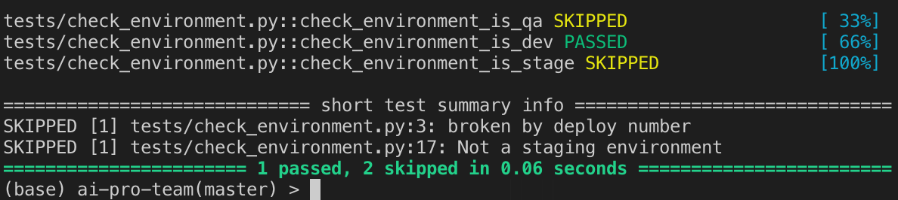
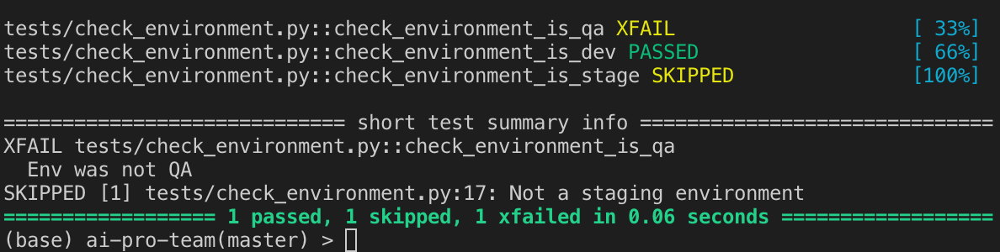
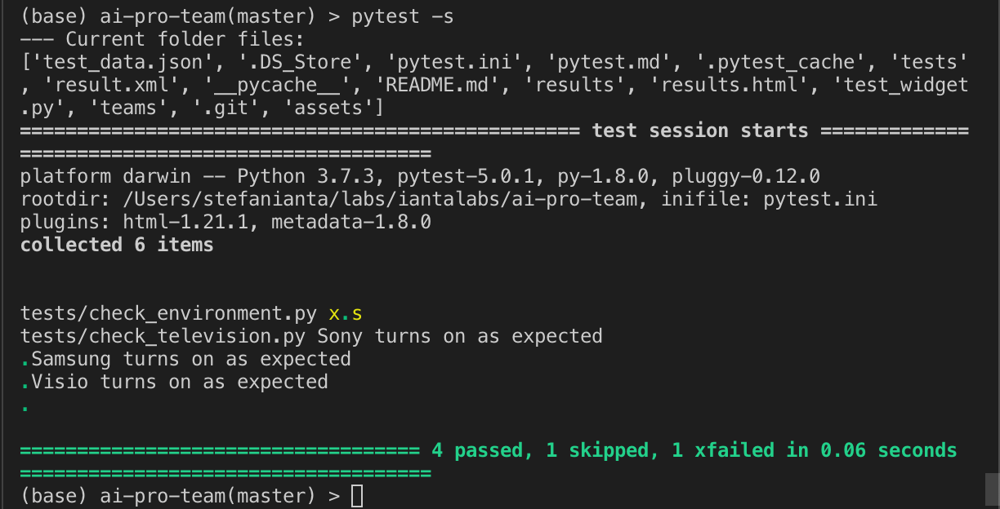
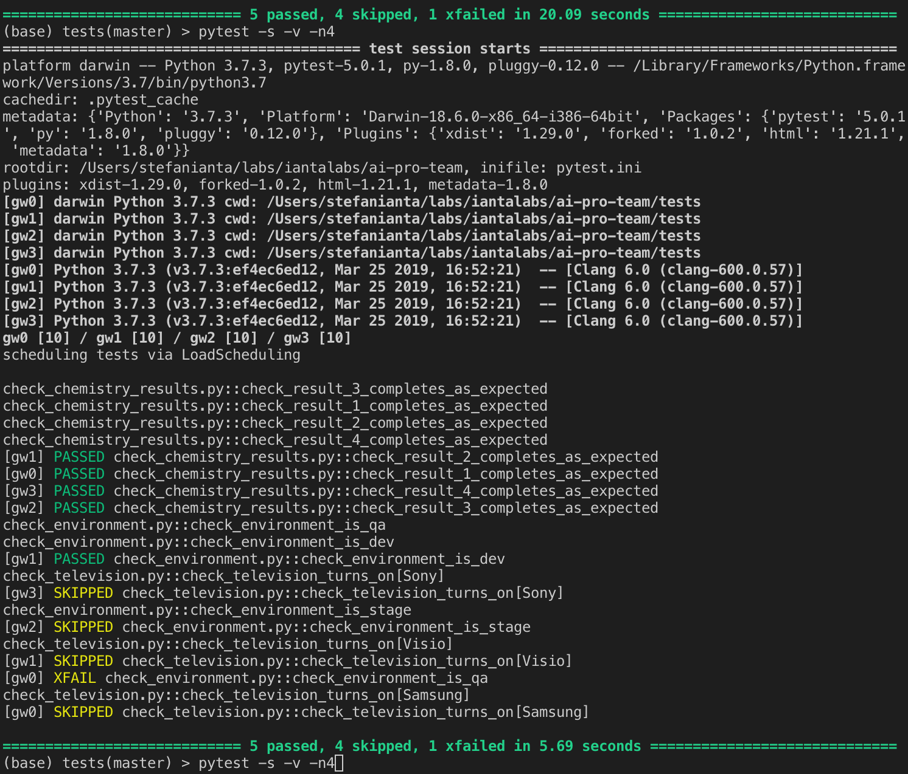
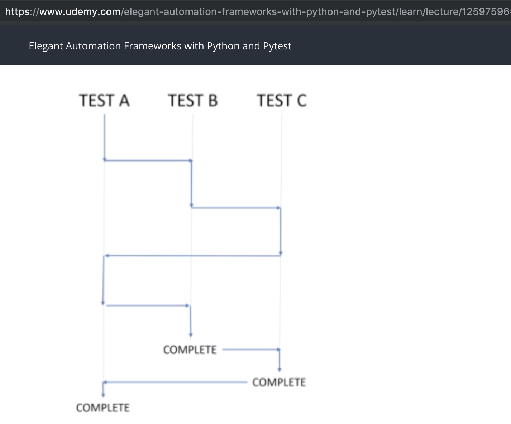
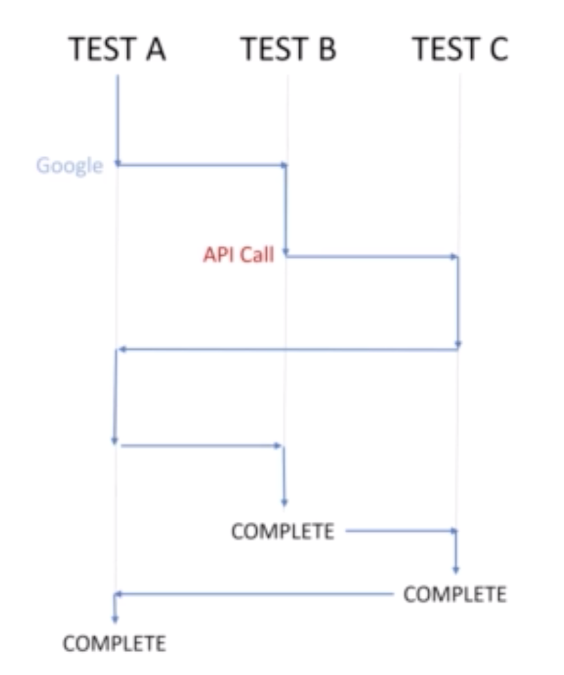
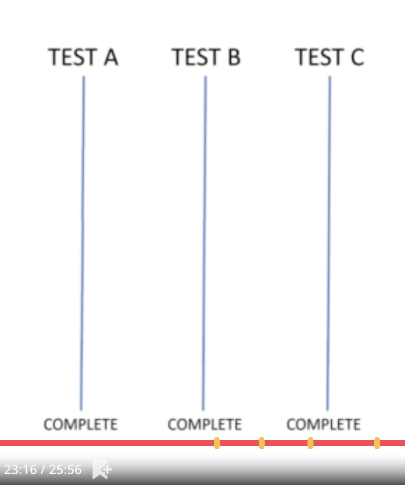

# Pytest

July 26, 2019
-------------

notes from Udemy Course:
https://www.udemy.com/elegant-automation-frameworks-with-python-and-pytest/

### pytest.ini

[pytest]
python_files = test_*
python_classes = *Tests
python_functions = test_*

##Test Searching

from pytest import mark

https://docs.pytest.org/en/latest/example/markers.html

@mark.smoke
@mark.engine
def test_..._

// test only marks
pytest -m engine
pytest -m smoke

pytest -m "engine or smoke"

pytest -m "not entertainment"

// Summary of markers as documented on pytest.ini !!! 
pytest --markers

## Test Fixtures

conftest.py

from pytest import fixture

from selenium import webdriver

'''
scope='function' - for each test function
scope='session' - for the entire test session / all functions eg. same browser instance
'''
@fixture(scope='function')
def chrome_browser():
    browser = webdriver.Chrome()
    yield browser       # or return

    # teardown
    print('I am tearing down this browser')
	
----

// -s - for showing console prints
// -v - verbose
pytest -m ui -s -v

-------
## Test Results and History

 conda install pytest-html
 
pip install pytest-html

pytest --html="results.html"

pytest --junitxml="result.xml"

## Customized Test runs with Comand Line and Config File

---------

July 27, 2019
-------------
## Config recipe
https://github.com/brandonblair/elegantframeworks/tree/config_recipe

## config.py

```
class Config():
    def __init__(self, env):

        self.base_url = {
            'dev': 'https://mydev-env.com',
            'qa': 'https://myqa-env.com'
        }[env]

        self.app_port = {
            'dev': 8080,
            'qa': 80
        }[env]
```

## argparse - Parser for command line options, args, subcommands
https://docs.python.org/3/library/argparse.html

- Arguments eg: -m -p -h

- in conftest.py
```
def pytest_addoption(parser):
    parser.addoption(
        "--env",
        action="store",
        default="dev",
        help="Environment to run tests against"
        )
```
- the above will insert in pytest -h the following:
```
custom options:
  --env=ENV             Environment to run tests against
```
---------

- Fixture to use --env

```
@fixture(scope='session')
def env(request):
    return request.config.getoption("--env")
```

- then it is storing for the session the env from the command line eg: 
```
pytest --env=qa
or
pytest --env qa
or 
pytest --env="qa"
```
----------

## Handling Skips and Expected Failures
https://docs.pytest.org/en/latest/skipping.html

- marked tests

```python
from pytest import mark

@mark.xfail(reason="Env was not QA")
def check_environment_is_qa(app_config):
    base_url = app_config.base_url
    port = app_config.app_port
    assert base_url == 'https://myqa-env.com'
    assert port == 80

def check_environment_is_dev(app_config):
    base_url = app_config.base_url
    port = app_config.app_port
    # driver.get(base_url)
    assert base_url == 'https://mydev-env.com'
    assert port == 8080

@mark.skip(reason="Not a staging environment")
def check_environment_is_stage(app_config):
    base_url = app_config.base_url
    assert base_url == 'stage'
```


- -rs for listing the reasons on skipps
```
pytest --env dev -v -rs
```


- listing both skipps and xfails (expected fails)
```bash
pytest --env dev -v -rxs
```


- example xfail reason: 'This feature should have been deprecated'
- example skip reason: 'Broken, fixing next sprint'
- reasons to provide understandable, actionable info
- some people use wip - work in progress as custom markers 
- shouldn't be wip in a production test suite
- build and maintain confidence in the test suites
- test suites need to consistently bring value, build confidence in progress
- test suites need to be maintained / based on logged/auditable decisions

## Parametrize Cross-Browser and Data-driven testing
https://docs.pytest.org/en/latest/parametrize.html
https://techstepacademy.com/training-ground
https://www.udemy.com/elegant-browser-automation-with-python-and-selenium/learn/lecture/8755008#overview
https://github.com/brandonblair/elegantframeworks/tree/parametrize

```python
# tests will run for each param / tuple in the list - here 3 brands
@mark.parametrize('tv_brand', [
    ('Samsung'),
    ('Sony'),
    ('Visio'),
])
def check_television_turns_on(tv_brand):
    print(f"{tv_brand} turns on as expected")
```

- Parametrized browser test example:
```python
# test will be run for each item inn the params list
@fixture(params=[webdriver.Chrome, webdriver.Firefox, webdriver.Edge])
def browser(request):
    driver = request.param
    drvr = driver()
    yield drvr
    drvr.quit()
```
July 29, 2019
-------------
- in conftest.py - parametre file test_data.json
```python
import os
import json

from pytest import fixture
from selenium import webdriver

from config import Config

data_path = 'test_data.json'

# Confirm current test directory
print('--- Current folder files:')
print(os.listdir())

def load_test_data(path):
	with open(path) as data_file:
		data = json.load(data_file)
		return data
		# returns data in a dictionary form

# def test_data(request):
@fixture(params=load_test_data(data_path))
def tv_brand(request):
	data = request.param
	return data
```
- then in test script file:

```python
def check_television_turns_on(tv_brand):
    print(f"{tv_brand} turns on as expected")
```
- in test_data.json :
```json
[
    "Sony",
    "Samsung",
    "Visio"
]
```
- the with pytest -s 



-----------

## Fast Testing with Pytest-xdist and Parallel vs Concurrent
https://www.udemy.com/elegant-automation-frameworks-with-python-and-pytest/learn/lecture/12597596#overview
https://github.com/BrandonBlair/elegantframeworks/tree/parallel/tests
https://pypi.org/project/pytest-xdist/

- install pytest-xdist:
```bash
pip install pytest-xdist
```
- launch pytest with 4 xdist threads/processes for nearly 4 time faster speed:
```bash
pytest -s -v -n4
```


July 30, 2019
-------------

- benchmark with pytest -nauto
```bash
pytest -s -v -nauto
```
- checking / testing / processing with concurrent threads (eg: 3 concurrent threads in one process)

 

- top efficiency when waiting for external calls/processing (other processing responsibility)



- Parallel processing with 3 isolated processes (no shared memory)
- on 3 Global Interpretor Locks (GIL)



## Writing Unit Tests - White Box Testing

https://github.com/BrandonBlair/elegantframeworks/tree/unittesting
https://github.com/BrandonBlair/elegantframeworks/tree/unittesting1

- unit testing - by def no dependencies - everything should be inside the code
- to rename as __*White Box Checking*__ - for I/O checking steps of the protocol
- recommendation to have tests dir outside (in parallel) the code module
- unit tests dir with similar dir structure of the code/package dir
- Idea ToDo [!] - ai checks should be packaged inside the module as i/o checks
- installed demo titlecase project (Titlecase) package locally with:
```bash
pip install .
```
- python -m <module> - command to run a module eg:
```bash
python -m pytest
```
- to run pytest in a different dir (tests):
```bash
python -m pytest tests
```
- to run pytest and avoid import issues - import the code as extended with -e:
( . for whatever setup / module in the current dir)
```bash
pip install -e .
```
## Running Unit Tests with Tox

https://tox.readthedocs.io/en/latest/

- tests are not part of the library / but i/o checks are part of the project 
- tests are not what end user need ?! => but for recombinant API, tests / (i/o checks) need to be packaged and distributed together with the project !!!
- for tox installation the environment must be deactivated => conda deactivate
```bash
conda deactivate
```
- install tox with
```bash 
pip install tox
```
- Configure tox.ini including config for pytest like in pytest.ini
- then run test with the command: tox
```bash
tox
```

## Writing Functional Tests (Black/Grey Box Testing)

https://github.com/brandonblair/elegantframeworks/tree/functionaltests
https://techstepacademy.com/training-ground

- sample functional / API test assert
```python
import requests

def test_twitter_is_present():
    resp = requests.get("http://techstepacademy.com/training-ground")
    assert "twitter" in resp.text
```


