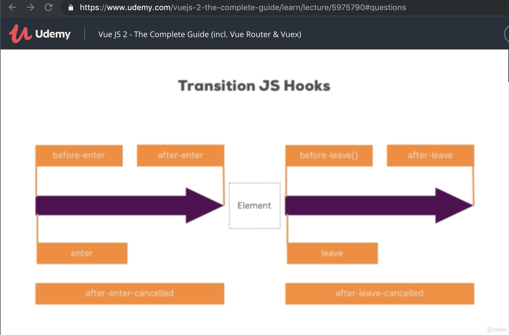

# Vue

Aug 1, 2019
-----------

notes from Udemy Course:
https://www.udemy.com/vuejs-2-the-complete-guide/

## VueJS interacting with the DOM

- v-once - just one rendering
```vue
<h1 v-once>{{ title }}</h1>
```

- v-html - to render html code
```vue
<p v-html="finishedLink"></p>
```

- v-on:click="methodToCallOnClick"

- Event object holds the event props: eg. onClick holds the coordinates where the click happened
```vue
<p v-on:mousemove="updateCoordinates">{{ x }} / {{ y }}</p>

...
data: {
    x: 0,
    y: 0
},
methods: {
    updateCoordiantes: function(event) {
        this.x = event.clientX;
        this.y = event.clientY;
    }
}
...
```

-

## Conditionals v-if, v-show and Rrendering lists v-for

- v-else-if - New in 2.1.0+
- Similar to v-else, a v-else-if element must immediately follow a v-if or a v-else-if element.
```vue
<div v-if="type === 'A'">
  A
</div>
<div v-else-if="type === 'B'">
  B
</div>
<div v-else-if="type === 'C'">
  C
</div>
<div v-else>
  Not A/B/C
</div>
```

## Animations and Transitions

- add transition class eg: fade
- then vue will attach fade-enter, fade-enter-active, fade-leave, fade-leave-active

- initial animation with: appear

- transition between multiple elements with: mode="out-in" or mode="in-out"

- transition JS hooks:



## Vue CLI 3

- install on mac with
```bash
sudo npm install -g @vue/cli
```
- create new app project with
```bash
vue create new-app
```

